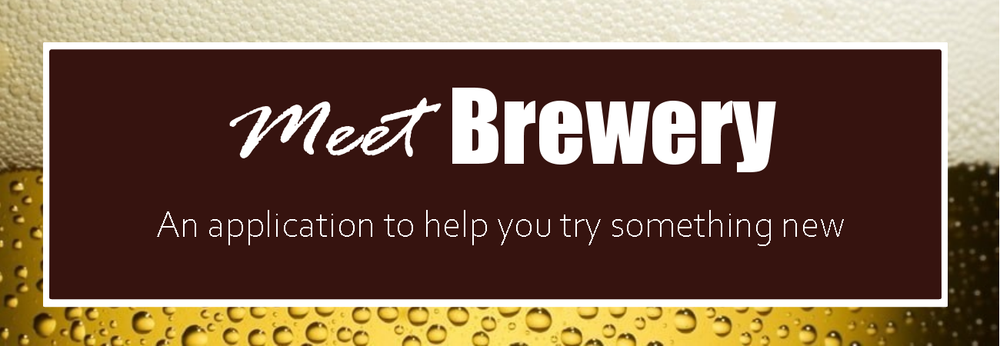
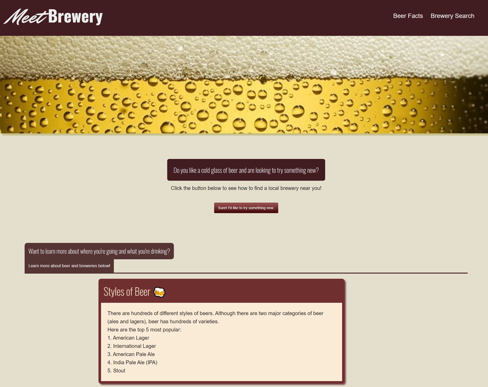

  

  

    <a href="https://github.com/matwll/nearby-breweries/issues">Report Bug</a>
    ·
    <a href="https://github.com/matwll/nearby-breweries/issues">Request Feature</a>
  

<!-- TABLE OF CONTENTS -->

  
Table of Contents

  <ol>
    <li>
      <a href="#about-the-project">About The Project</a>
      <ul>
        <li><a href="#built-with">Built With</a></li>
      </ul>
    </li>
    <li><a href="#usage">Usage</a></li>
    <li><a href="#contributing">Contributing</a></li>
    <li><a href="#license">License</a></li>
    <li><a href="#contact">Contact</a></li>
    <li><a href="#acknowledgments">Acknowledgments</a></li>
  </ol>

 
 

<!-- ABOUT OUR PROJECT -->
## About Our Project

<!--  -->

Our project was made to help users who are curious about trying something new, or who just want some help finding local brewery options near them. Our webpage was developed with ease of use in mind. The user can quickly navigate to our brewery search option from our landing page, or spend some time reading some fun brewery and beer facts in the fun facts section. After the user navigates to the search page they can type in their local city, or a city that they are visiting to find five random breweries within a fifty mile radius. In these results the user can find plenty of information about where they'd be visiting such as their business name, address, and website (if applicable).

This project was built by a small team of aspiring developers. This allowed for us to practice utilizing front end and back end developing skills that we are still learning, and the opportunity to practice using GitHub in a team setting. 

### Built With

This application was built using very basic framework to allow for fast load times and a fun challenge for our developers.

This application utilized:
* HTML5
* CSS3
* Foundation
* Font Awesome
* Google Fonts
* JavaScript

<!-- USAGE EXAMPLES -->
## Usage

Upon page load the user is presented with our landing page. On this page the user can use the navigation links in the header to quickly navigate to the fun facts or back up to the button that will bring them to our search page. 

Once the user has navigated to our search page they will find a very user friendly search bar that allows them to type in the city of their choice or to choose from a previous search if they have used our search bar before.

Upon searching for a new city or using a previous search, the user is brought to a results page that will display five local breweries for them to try. If the user is interested in one of their options, they should be sure to save that brewery's information because upon their next search of that city it's likely that they will get new results! In the displays of local breweries, the user will find information about their options such as name, address, and possible contact information if our API was able to provide it. They will also see some fun randomly generated gifs attached to the search results. These gifs are not tied to the specific brewery so check it out to see what results you get!

Our vision was for this application to be used by an audience that is either seeking out a brand new drinking experience or simply looking to explore unfamiliar places in their town or a town they're visiting.

<!-- CONTRIBUTORS -->
## Contributors

Check out members of our team on GitHub!

* [Matthew Williams](https://github.com/matwll)
* [Sabina Ceja-Siete](https://github.com/unisabi)
* [Spencer Rye](https://github.com/Syre11)
* [Katrina Baker](https://github.com/katbakr)

<!-- LICENSE -->
## License

See `LICENSE` for more information.

<!-- ACKNOWLEDGMENTS -->
## Acknowledgments

* [Beer Fun Facts Source](https://facts.net/beer-facts/#:~:text=01Beer's%20core%20ingredients%20are,47%20million%20kiloliters%20per%20year)
* [Cover Image for landing](https://timelinecovers.pro/covers/food-and-drinks/beer_facebook-cover-photo)
* [API for Brewery list](https://www.openbrewerydb.org/documentation)
* [API for Gifs](https://developers.giphy.com/)
